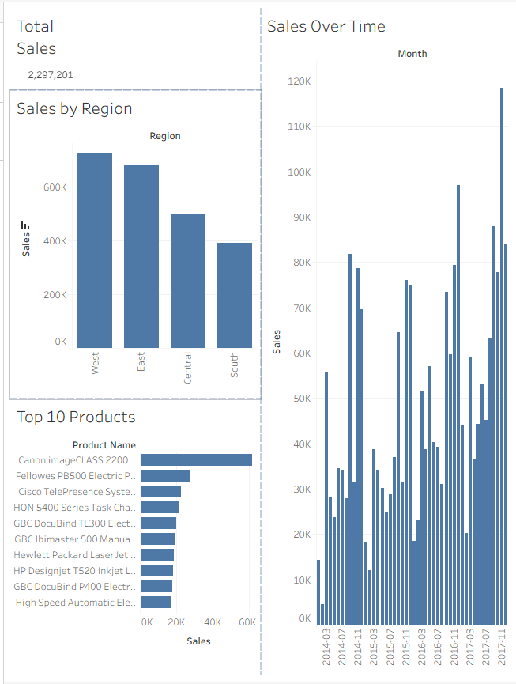

# Sales Data Analysis Project

## Overview
This project analyzes retail sales data to identify key business insights, including top-performing products, customer behavior, and regional trends.

## Tools Used
- SQL
- Python (Pandas)
- Tableau

## Key Insights
- Identified top-performing regions driving revenue
- Found high-value customers contributing significantly to sales
- Analyzed product performance to highlight best-selling items
- Observed trends in sales over time

## Project Components
- Data cleaning and analysis in Python
- SQL queries for business insights
- Tableau dashboard for data visualization

## Dashboard
