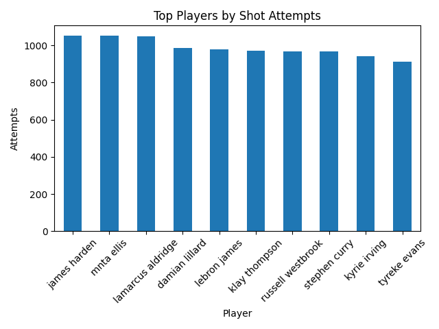
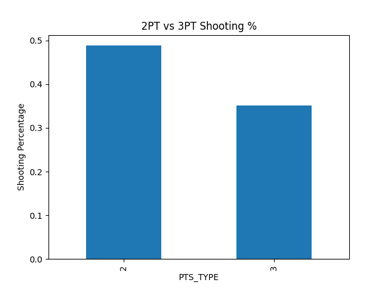

# NBA Shot Analysis & Player Performance

## Overview
This project analyzes NBA shot log data to evaluate player shooting efficiency and identify factors that influence shot success, including shot distance, shot type, and defender proximity.

## Tools Used
- Python
- Pandas
- Matplotlib

## Questions Explored
- Which players were the most efficient shooters among high-volume attempts?
- How does shooting percentage change with shot distance?
- Are 2-point shots more efficient than 3-point shots?

## Key Insights
- Shooting percentage generally declines as shot distance increases
- 2-point shots are typically more efficient than 3-point shots
- Players perform better when defenders are farther away
- High-volume shooters are not always the most efficient shooters

## Project Components
- Data cleaning and preprocessing
- Player-level shooting analysis
- Shot distance and defender impact analysis
- Visualizations to highlight performance trends

## Visuals

### Top Players by Shot Attempts

### Shot Type Efficiency
